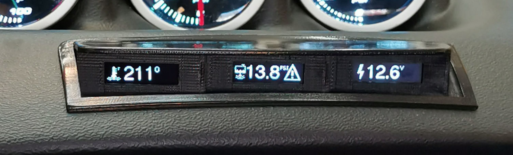
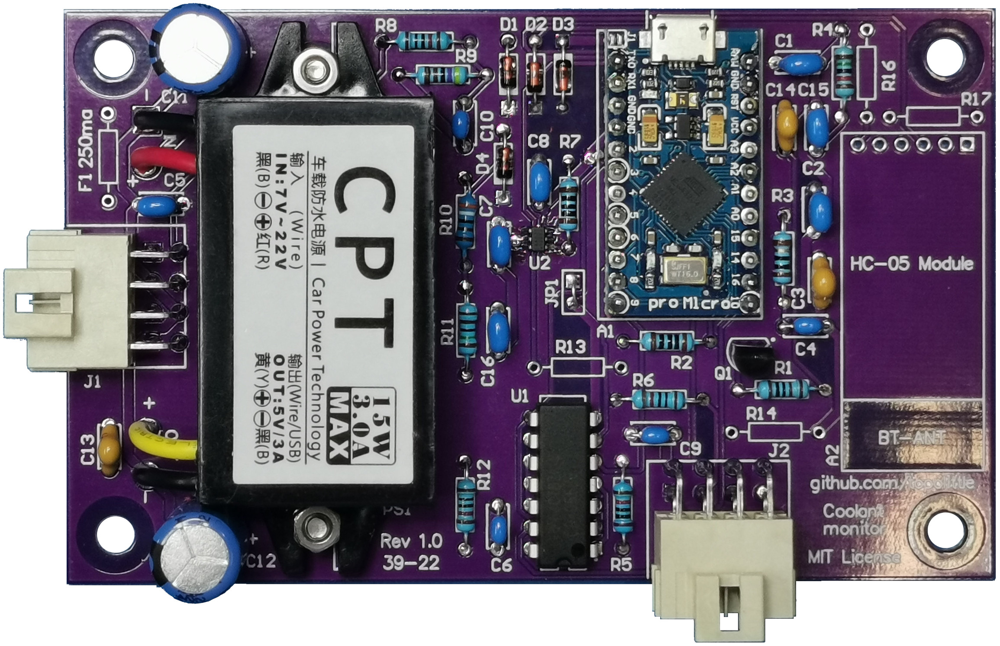
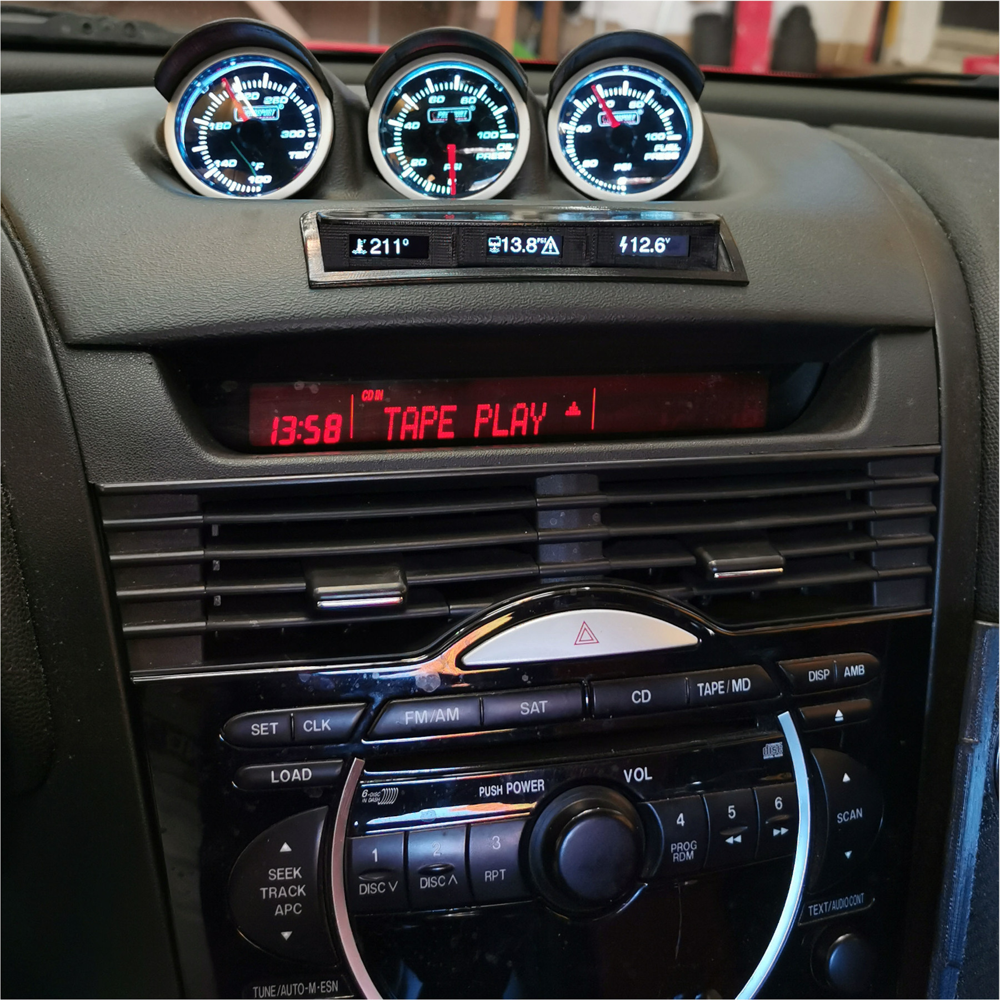

# MAZDA RX-8 Coolant monitor

The Mazda RX-8 lacks a proper gauge for displaying the coolant temperature. The stock gauge is more like a warning light than a real gauge. This project is about adding a display to the upper center console to display the coolant temperature and pressure. It also displays the battery voltage as a bonus.

This project doesn't use the OBD-II port, instead it uses dedicated sensors. The temperature sensor is from Delphi, which is very common in GM cars, and the pressure sensor is from AEM.

Although the project is for the Mazda RX-8, the electronic and the code could be used "as-is" for another car. The mechanical design, specifically the head unit, is made specific to integrate into aftermarket gauge pod, but it also should a stock RX-8 dashboard.

# License
Except for the files listed below, this project is under the 3-clause BSD license.
## Exceptions
 - OLED_0.91_128x32.SLDASM: [This 3D drawing is from Grabcad](https://grabcad.com/library/oled-0-91-128x32-1) therefore its licenses only allows non-commercial use.
 - FreeSans18pt7bNum.h: This file contains source code from the [Adafruit-GFX-Library](https://github.com/adafruit/Adafruit-GFX-Library/) project, which is under the 2-clause BSD license. A copy of the license is provided beside the file.

# Trademarks
The RX-8 logo used in the source code provided here is a trademark of MAZDA MOTOR CORPORATION.

I am not associated with or sponsored by any of the companies mentioned in this project. I simply use their products for my personal and non-commercial use.

# Mechanical design
The mechanical design consists of two part:
- The enclosure for the PCB controller
- The head unit
## Head unit
The head unit contains three 128x32 OLED displays and it's designed to fit into a Lotek gauge pod, part #LTK-RX8-3DSH. The pod must be cut to accommodate the head unit. A cutting jig is included in the design, see below. Since the Lotek pod reproduces the same curved surface as the OEM dashboard, the design should fit a stock RX-8 without any modification.
### How to print:
Material: ASA (Do not use PLA since it will deform when exposed to the sun)
Layer height: 0.1mm
Supports: Yes, soluble for the best results
Difficulty: Expert
## Display holder
This is for holding the OLED displays in place. They require also an M3 screw each (See the BOM).
### How to print:
Material: ASA
Layer height: 0.2
Supports: No
Difficulty: Beginner
## Cutting JIG
Place the cutting JIG on the Lotek gauge pod, or on the stock dashboard pod, and mark the inside with a pen. This is where you have to cut. I used a Dremel with a small 0.5" saw blade attached to cut the pod.
### How to print:
Material: ASA, ABS or PLA
Layer height: 0.2
Supports: No
Difficulty: Beginner
## PCB Enclosure
It's a two parts enclosure: Top and bottom. The PCB goes inside and is held by four M4 screws (see the BOM). The bottom comes in two variants: One without anchor and one with two anchors for T-RAP. This can be useful if you don't want to use double sided tape to fix the enclosure inside the dashboard  

Note: Since the communication between the PCB controller and the head unit uses I2C, the controller should be placed as close to the head unit as possible. Avoid having more than 12 inches of cables between the two.
### How to print:
Material: ASA
Layer height: 0.2
Supports: No
Difficulty: Beginner
# Embedded
This is the code for the Arduino based Pro Micro. The main purpose is to read the actual values for various sensors and display the value on three independent OLED displays over I2C.
## Compile
You can use the Arduino IDE or you can use the provided devcontainer for VSCode. To do so:
1. Open the folder `EMBEDDED` with VSCode
2. View -> Command Palette
3. Type `Dev Containers: Reopen in Container`
4. Inside the container, use `ctrl_alt+R` to compile and `ctrl+alt+U` to upload  
 
Note: The devcontainer has been tested on Linux Fedora 35/36 and Oracle Linux 8.6. It might work with Windows 10+ under WSL2 but it's not tested.

## I2C multiplexing
Since the displays used here don't provide a way to configure their I2C address, the code multiplexes the data lines using extra I/O pins with the help of some *glue logic* components on the PCB.
## Temperature sensor (thermistor)
For reading the coolant temperature with a greater accuracy, an additional reference resistor is engaged at a specific temperature by a digital IO and a MOSFET on the PCB to lower the overall thermistor reference. This puts the reference resistor closer to the actual thermistor value at high temperature. A small hysteresis is in place to avoid switching back and forth the resistor too often. The conversion between the thermistor value and the actual temperature is achieved using the Steinhart-Hart equation. 
Note the project uses a Delphi temperature sensor but an AEM sensor can be used instead, see the BOM. If you want to use a different sensor than those two, you may have to adjust the three coefficients of the Steinhart-Hart equation inside the `getCoolantTempCelsius()` function.
## Reference voltage
Reading the battery voltage and the pressure sensor requires a precise reference voltage. To achieve better accuracy than using the internal Atmega 32U4 reference, an external reference voltage is used. The code reads the reference and makes appropriate corrections based on the actual read value.
## Unit of measure
You can choose between Celsius and Fahrenheit by pulling the digital I/O pin 8 high or low. The is a jumper on the PCB for that purpose.
## Customization
The file `coolant_monitor.h` contains definitions that can be customized to suit your needs. Here is the list of what you can customize:
- Coolant temperature high warning
- Coolant PSI high warning
- Battery voltage low warning
- Battery voltage high warning
- Display refresh rate
- Thermistor reference resistors
- Thermistor second reference resistor threshold and hysteresis
- Voltage divider values for the battery voltage
- Various analog to digital conversion parameters
- Various icons and logos
# Electronic

A custom PCB incorporates the Adruino based Pro Micro and other important components. The main parts of this electronic design are:
- A DC-DC Converter to adapt the unstable voltage of the car (11V to 15V) to a steady 5V for the Pro Micro, sensors and other components
- A reference voltage for the various analog acquisitions performed by the Pro Micro
- The *glue logic* required to multiplex the I2C data lines
- Parking lights detection and protection circuit
- Voltage divider for reading the battery voltage
- Reference voltage for the coolant temperature thermistor
- Various signal filtration
- Connector for easily installing and removing the PCB and the enclosure from the car
- Optional Bluetooth module (not tested)
## Conformal coating
Since the PCB goes into a car, applying a silicon based conformal coating is required. Be sure to mask the connectors when doing so.
## Bluetooth
An optional Bluetooth HC-05 module can be added to control the unit. However, it doesn't have been tested as of version 1.0.  
Note: Using Bluetooth will require a custom Android app. Sorry for IOS users, it's standard Bluetooth, not Bluetooth MFI.  
Here are some future improvements which would be possible with Bluetooth:
- Over-The-Air firmware update, it may be possible with the stock bootloader, maybe not.
- Toggle the temperature units between Celsius and Fahrenheit
- Toggle the pressure units between PSI and Bar
- Display the coolant boiling point. Calculated base of a coolant/water ratio, configurable via Bluetooth
- Adjust the warning threshold for the various parameters
- Support for other sensers, configurable via Bluetooth

# Final product installed in the car

